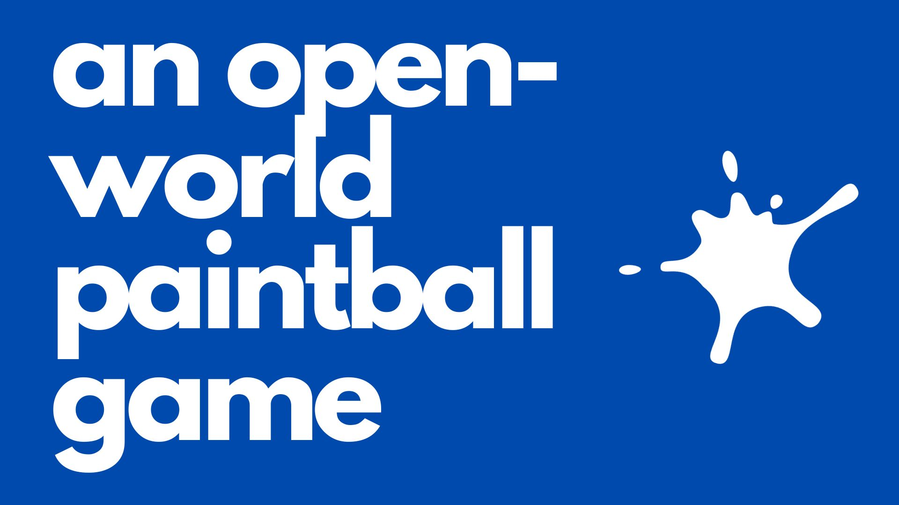

# Painter.IO

<table align="center" border="0" cellspacing="0" cellpadding="0" style="border-collapse: collapse;">
    <tr>
        <td style="border: none;"></td>
        <td style="border: none;"></td>
    </tr>
</table>

**An engaging open-world paintball game developed using Unreal Engine.**

Dive into the colorful world of paintball, where players can buy equipment, engage in thrilling battles, evolve their skills, and strategically build their inventory to beat opponents.

---

## 📖 Table of Contents
- [Features](#features)
- [Installation](#installation)
- [Usage](#usage)
- [Feedback & Suggestions](#feedback--suggestions)

---

## 🌟 Features

- **Open-world Environment**: Explore a vast, detailed world filled with strategic positions and surprises.
- **Player Functionality**:
  - **Buying**: Acquire new equipment and tools to strengthen your player.
  - **Battling**: Engage in dynamic paintball combats, challenging both your reflexes and strategy.
  - **Inventory Management**: Strategically build and manage your inventory for an edge over opponents.
- **Beta Testing Adjustments**: We value player feedback. Post our beta-testing phase, we've incorporated numerous suggestions leading to crucial game design adjustments.

---

